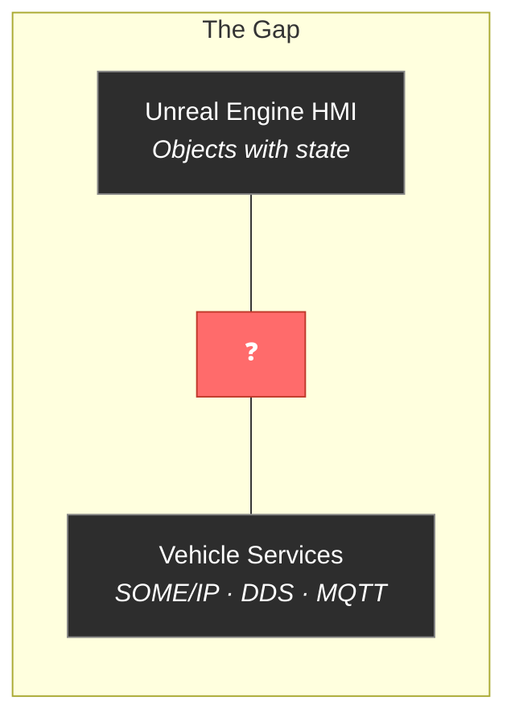
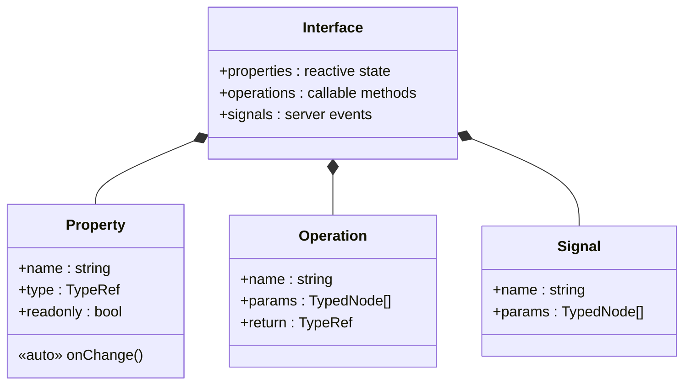
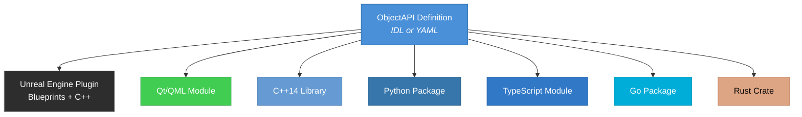
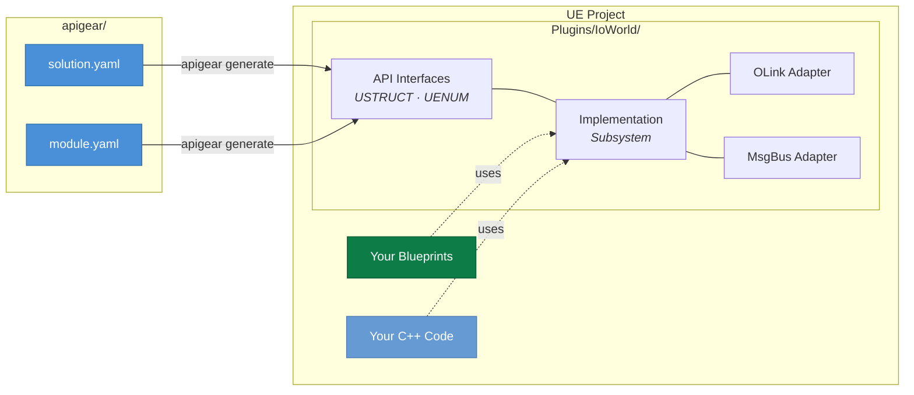
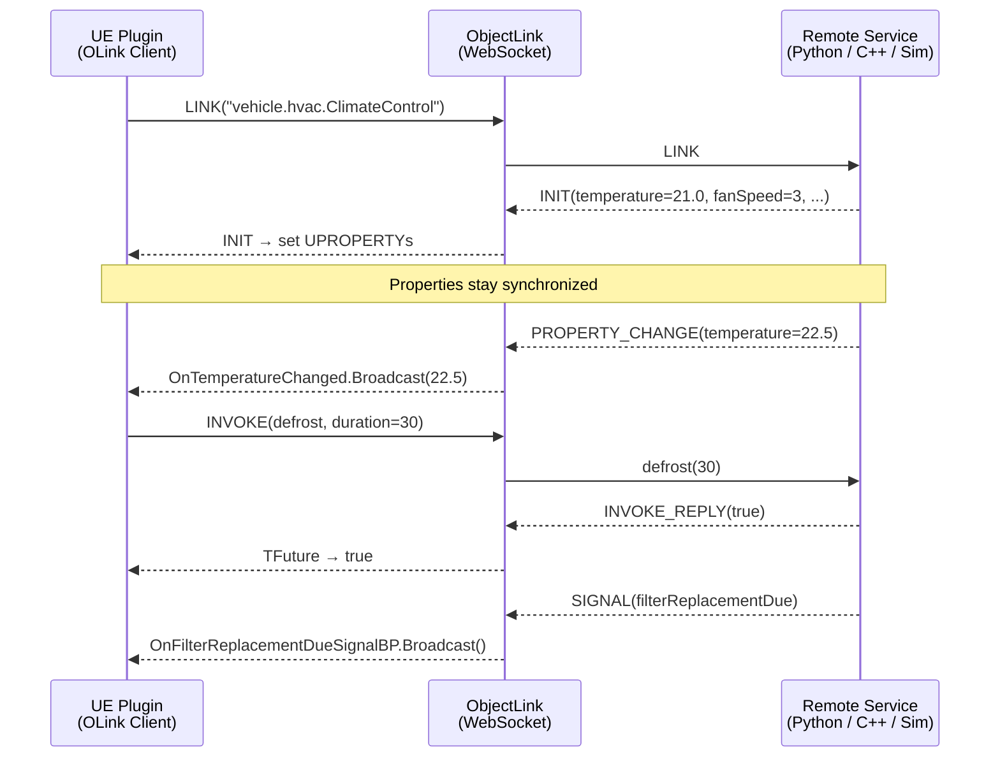
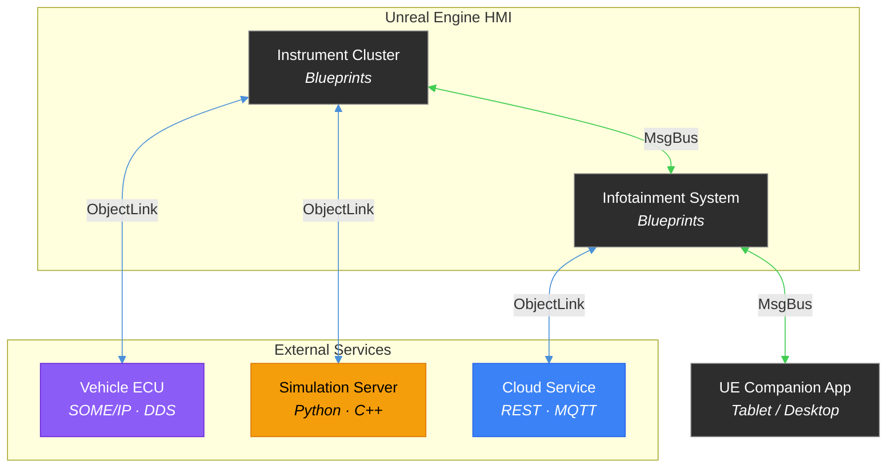
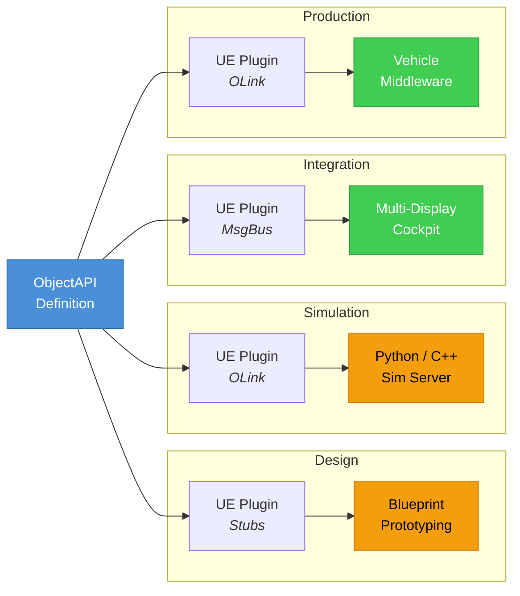

REST and event-driven APIs were designed for the web. But Unreal Engine digital cockpits, automotive HMIs, and embedded devices think in objects with state — not stateless HTTP requests. The Object API specification bridges this gap by modeling APIs as reactive objects with properties, operations, and signals. With ApiGear — part of Epic Games — a single API definition generates fully functional Unreal Engine plugins with Blueprint and C++ support, connected via the ObjectLink protocol or UE's native MsgBus. One contract, from simulation to production.

<!--truncate-->

## Unreal Engine Is Driving the Next Generation of HMI

Unreal Engine has become the platform of choice for automotive Human-Machine Interfaces. Over 35 car models have shipped with UE-powered digital cockpits — including the GMC HUMMER EV, Ford Mustang, Rivian R1T, and Sony Honda's AFEELA 1 — with more than two million cars on the road running Unreal Engine HMI today.

At CES 2026, Epic Games demonstrated a UE5 Next-Gen HMI Experience: a single Unreal Engine instance simultaneously rendering the instrument cluster, maps, control panel, and 3D backgrounds across multiple high-resolution displays at 60fps. The era of fragmented, specialized rendering technologies for each cockpit screen is ending. One engine drives everything.

But this creates a new challenge: **how do you connect these rich, real-time Unreal Engine experiences to external data?** Vehicle telemetry, HVAC state, battery status, navigation data, ADAS signals — all of this lives outside Unreal Engine, on vehicle buses like SOME/IP and DDS, or in cloud services. How do you bridge that gap without drowning in glue code?

This is exactly the problem the Object API was designed to solve.



## The Problem: A Paradigm Mismatch

Your Unreal Engine HMI thinks in objects. An instrument cluster has a `speed` property. A climate control has a `temperature` property. When data changes, the UI updates through Blueprints or C++ delegates. Simple.

But the moment you try to connect that to an external service, you're handed a flat signal list, a REST API, or a gRPC proto file and told to "make it work." Suddenly, your clean architecture collapses into a tangle of JSON parsing, polling loops, and manual state synchronization — all wired together with fragile adapter code that nobody wants to maintain.

```
// What Unreal Engine expects
ClimateControl->Temperature = 22.5f;
OnTemperatureChanged.Broadcast(22.5f);  // UI updates automatically

// What REST gives you
GET /api/v1/hvac/zones/front/temperature → { "value": 22.5 }
// Now poll every 500ms? Roll your own WebSocket layer?
// Manually convert JSON to USTRUCTs?
// Write change detection by hand?
```

This isn't a tooling problem. It's a paradigm mismatch. REST, gRPC, and AsyncAPI model *communication patterns*. Unreal Engine models *objects with state*. You need an API specification that speaks the same language as your engine.

## What Is the Object API?

The [Object API](https://apigear.io/docs/objectapi/intro) (ObjectAPI) is a specification for defining **stateful, object-oriented APIs**. Developed by ApiGear — part of Epic Games — it models systems the way developers and UI frameworks actually think: as objects with three core concepts:

- **Properties** — observable state that changes over time, with automatic change notifications
- **Operations** — callable methods supporting both synchronous and asynchronous execution
- **Signals** — server-initiated events pushed to clients



Here's a climate control interface in ObjectAPI's IDL:

```
module vehicle.hvac 1.0

interface ClimateControl {
    // Reactive properties — change notifications are automatic
    temperature: float
    fanSpeed: int
    readonly outsideTemperature: float
    mode: ClimateMode

    // Operations — explicit actions
    setTargetTemperature(zone: Zone, temp: float)
    defrost(duration: int): bool

    // Signals — server pushes events
    signal seatHeaterReady(zone: Zone)
    signal filterReplacementDue()
}

enum ClimateMode {
    Off = 0,
    Heating = 1,
    Cooling = 2,
    Auto = 3
}

struct Zone {
    name: string
    row: int
    side: string
}
```

This same definition can be expressed in YAML for tooling and validation:

```yaml
schema: apigear.module/1.0
name: vehicle.hvac
version: "1.0"

interfaces:
  - name: ClimateControl
    properties:
      - name: temperature
        type: float
      - name: fanSpeed
        type: int
      - name: outsideTemperature
        type: float
        readonly: true
      - name: mode
        type: ClimateMode
    operations:
      - name: setTargetTemperature
        params:
          - { name: zone, type: Zone }
          - { name: temp, type: float }
      - name: defrost
        params:
          - { name: duration, type: int }
        return:
          type: bool
    signals:
      - name: seatHeaterReady
        params:
          - { name: zone, type: Zone }
      - name: filterReplacementDue
```

From this single definition, ApiGear generates type-safe bindings for **Unreal Engine (C++ and Blueprints)**, Qt/QML, C++14, Python, Go, TypeScript, Rust, and more.



## From API Definition to Unreal Engine Plugin

This is where the Object API and the Unreal Engine ecosystem come together. ApiGear's [Unreal Engine template](https://apigear.io/template-unreal/docs/intro) generates a **complete, production-ready UE plugin** from your API definition — with full feature parity between Blueprints and C++. It supports UE 4.27 through UE 5.7.

### Define Your API

Place a module file and a solution file in an `apigear/` folder next to your UE project:

```yaml
# apigear/helloworld.module.yaml
schema: apigear.module/1.0
name: io.world
version: "1.0.0"

interfaces:
  - name: Hello
    properties:
      - { name: last, type: Message }
    operations:
      - name: say
        params:
          - { name: msg, type: Message }
          - { name: when, type: When }
        return:
          type: int
    signals:
      - name: justSaid
        params:
          - { name: msg, type: Message }

enums:
  - name: When
    members:
      - { name: Now, value: 0 }
      - { name: Soon, value: 1 }
      - { name: Never, value: 2 }

structs:
  - name: Message
    fields:
      - { name: content, type: string }
```

### Generate the Plugin

```bash
apigear generate solution apigear/helloworld.solution.yaml
```

The generated code lands directly in your project's `Plugins/` folder — a fully functional Unreal Engine plugin, ready to enable in the editor.



### Use It in Blueprints

Open any Blueprint and your entire API is available as nodes:

1. **Get the subsystem** — retrieve `IoWorldHelloImplementation` from the GameInstance
2. **Call operations** — use async variants (e.g., "Async Say") that don't block the game thread
3. **Subscribe to property changes** — bind to `OnLastChangedBP` delegate through the Publisher object
4. **React to signals** — bind to `OnJustSaidSignalBP` to handle server-pushed events

Every property, operation, and signal from your API definition appears as a Blueprint node. Designers and technical artists can wire up data-driven UIs without writing a single line of C++.

### Or Use It in C++

For teams that prefer native code, the same plugin provides a complete C++ API:

```cpp
// Get the interface through the subsystem
TScriptInterface<IIoWorldHelloInterface> Hello =
    GetGameInstance()->GetSubsystem<UIoWorldHelloImplementation>();

// Call an operation
FIoWorldMessage MyMsg;
MyMsg.content = FString("Hello world");
Hello->Say(MyMsg, EIoWorldWhen::IWW_Now);

// Or use async for network calls — never block the game thread
TFuture<int32> Future = Hello->SayAsync(MyMsg, EIoWorldWhen::IWW_Now);
Future.Next([](const int32& Result) {
    UE_LOG(LogTemp, Log, TEXT("Say returned: %d"), Result);
});

// Subscribe to property changes via delegates
Hello->_GetPublisher()->OnLastChangedBP.AddDynamic(
    this, &UMyClass::OnLastChanged);
```

## Connecting Unreal Engine to the World: ObjectLink and MsgBus

Defining the API and generating the plugin is only half the story. The generated plugin needs to communicate with actual services. ApiGear provides two protocol adapters as generated features — each serving a different architecture.

### ObjectLink: Linking Objects Across the Network

The [ObjectLink protocol](https://apigear.io/docs/protocols/objectlink/intro) is a lightweight IPC protocol designed to **link a local object to a remote object** across network boundaries. It directly mirrors the Object API's three pillars:

- **Properties** are synchronized between local and remote objects
- **Operations** use request/response semantics
- **Signals** propagate from remote to local objects

The protocol defines eight message types that handle the complete lifecycle:

| Message | Purpose |
|---------|---------|
| `LINK` | Link a local object to its remote counterpart |
| `INIT` | Initialize the local object with remote property values |
| `UNLINK` | Disconnect the object link |
| `SET_PROPERTY` | Send a property change to the remote object |
| `PROPERTY_CHANGE` | Broadcast property changes to all linked clients |
| `INVOKE` / `INVOKE_REPLY` | Remote method invocation with response |
| `SIGNAL` | Broadcast events to all linked clients |

ObjectLink uses JSON as its notation format, with support for MsgPack and CBOR encodings. It is transport-agnostic — typically running over WebSockets, but decoupled from any specific network stack.

**In the Unreal Engine plugin**, enabling the `olink` feature generates a client and server adapter for each interface:

- **OLink Client**: Drop-in replacement for the local implementation. Your Blueprints and C++ code call the same interface, but operations execute remotely and property changes arrive over the network.
- **OLink Server**: Exposes your UE implementation as a remote service that other applications can connect to.

This means you can connect your Unreal Engine HMI to:
- A **Python simulation** running on a developer's laptop
- A **C++ service** on an embedded ECU
- Another **Unreal Engine** instance running a different part of the cockpit
- ApiGear's **simulation tools** for design-time data injection

All through the same ObjectLink protocol, all using the same generated interface. The UE application doesn't know or care what's on the other end.



### MsgBus: Unreal Engine-to-Unreal Engine Communication

For scenarios where multiple Unreal Engine instances need to communicate — a desktop development tool talking to a tablet companion app, a cluster display synchronized with an IVI system, or a distributed simulation — the `msgbus` feature generates adapters that use **Unreal Engine's native messaging infrastructure**.

This is particularly relevant for automotive HMI architectures where the instrument cluster and infotainment system run as separate UE instances on the same hardware or across a local network. MsgBus provides:

- Zero external dependencies — uses UE's built-in `IMessageBus`
- Same ObjectAPI interface — Blueprints and C++ code remain unchanged
- Local and networked operation — works within a process, across processes, or across machines

### Choosing the Right Protocol

| Scenario | Protocol |
|----------|----------|
| UE connected to external service (Python, C++, cloud) | **ObjectLink** |
| UE connected to ApiGear simulation | **ObjectLink** |
| UE-to-UE communication (cluster ↔ IVI) | **MsgBus** |
| UE-to-UE across devices (desktop ↔ tablet) | **MsgBus** |
| Local development with stubs | **None** (use generated stubs) |

The critical point: **your Blueprints and C++ code never change**. The protocol is a deployment configuration, not a code change. The same `OnTemperatureChanged` delegate fires whether the data comes from a local stub, an ObjectLink connection to a Python simulation, or a MsgBus link to another UE instance.

## What Gets Generated

The Unreal Engine template produces several layers through feature switches in the solution file:

| Feature | What It Generates |
|---------|-------------------|
| **api** | Interface files, abstract base classes, USTRUCTs, UENUMs |
| **stubs** | C++ stub implementations with test cases |
| **plugin** | Complete functional plugin with implementations |
| **monitor** | Decorator class for API traffic logging and debugging |
| **olink** | ObjectLink client and server adapters |
| **msgbus** | UE MsgBus client and server adapters |

Each feature is opt-in. Start with `stubs` for prototyping, add `olink` when you're ready to connect to external services, enable `monitor` for debugging integration issues.

## Why This Matters for Automotive HMI

### 1. It Matches How Unreal Engine Works

Unreal Engine is built around `UPROPERTY`, delegates, and subsystems. The Object API maps directly to these concepts:

| ObjectAPI Concept | Unreal Engine Mapping |
|-------------------|----------------------|
| Property | `UPROPERTY` with `OnPropertyChanged` delegate |
| Operation | `UFUNCTION` with async variant returning `TFuture` |
| Signal | Dynamic multicast delegate (`OnSignalBP`) |
| Struct | `USTRUCT` with `UPROPERTY` fields |
| Enum | `UENUM` with prefixed values |

No adapter layers. No manual state synchronization. The API contract and the engine contract are the same contract.

### 2. It Decouples Teams Completely

In automotive programs, the Unreal Engine HMI team, the embedded platform team, and the cloud services team often work on different timelines — sometimes in different companies. The Object API serves as a clean boundary:



### 3. Simulation from Day One

With the OLink feature, designers and testers can feed data into a running Unreal Engine HMI without real hardware. A Python script simulating vehicle telemetry connects via ObjectLink — the UE application receives property changes and signals exactly as it would from the production vehicle bus.

This is critical for automotive programs where hardware arrives months after HMI development begins. The same Ford Mustang cluster UI that was prototyped against a simulated backend runs unchanged against the real vehicle network.

### 4. Multi-Display Cockpit Architecture

Modern digital cockpits run multiple UE instances: one for the cluster, one for the IVI, possibly one for the passenger display. MsgBus lets these instances share state through the same ObjectAPI interfaces — the cluster and IVI both observe the same `Navigation` interface, and route updates propagate instantly to both displays.

### 5. One Contract, Every Deployment Stage



One specification. Generated plugins. Zero rewrite across deployment stages.

## A Real-World Example: Digital Instrument Cluster

Consider an automotive instrument cluster built in Unreal Engine — the kind shipping in vehicles today:

```
module vehicle.cluster 1.0

interface Speedometer {
    speed: float
    readonly unit: SpeedUnit
    signal speedLimitExceeded(limit: float)
}

interface Tachometer {
    rpm: int
    readonly redlineRpm: int
    gear: int
    signal shiftSuggestion(targetGear: int)
}

interface FuelGauge {
    level: float
    range: float
    readonly capacity: float
    signal lowFuelWarning(remainingKm: float)
}

interface Navigation {
    currentInstruction: NavInstruction
    distanceToNext: float
    estimatedArrival: string
    signal routeRecalculated()
    signal destinationReached()
}

struct NavInstruction {
    text: string
    maneuver: Maneuver
    roadName: string
}

enum SpeedUnit {
    Kmh = 0,
    Mph = 1
}

enum Maneuver {
    Straight = 0,
    TurnLeft = 1,
    TurnRight = 2,
    UTurn = 3,
    RoundaboutExit = 4,
    MergeHighway = 5
}
```

Run `apigear generate solution` and you get a complete Unreal Engine plugin. In Blueprints:

- Bind a **speedometer needle** rotation to the `Speed` property — it updates automatically via the delegate when vehicle data arrives over ObjectLink
- Display a **warning widget** by subscribing to the `LowFuelWarning` signal
- Show **turn-by-turn navigation** by reading the `CurrentInstruction` property — a generated `USTRUCT` with `Text`, `Maneuver`, and `RoadName` fields
- Synchronize navigation state with the IVI display via **MsgBus** — both screens show the same route
- All without writing a single line of network or serialization code

The same specification also generates Qt/QML bindings for a secondary display, TypeScript bindings for a web companion app, and C++14 bindings for the vehicle middleware team.

## How ObjectAPI Compares

| Aspect | REST (OpenAPI) | Async (AsyncAPI) | RPC (gRPC) | **Object API** |
|--------|---------------|-------------------|------------|----------------|
| **State model** | Stateless | Event streams | Stateless | Stateful objects |
| **Change notification** | Poll or webhook | Events | Server streaming | Auto property signals |
| **Direction** | Client → Server | Pub/Sub | Bidirectional streaming | Bidirectional (properties + signals) |
| **UE integration** | Manual adapter | Manual adapter | Manual adapter | Generated plugin (Blueprints + C++) |
| **Type safety** | Optional | Schema-based | Strong (protobuf) | Strong (IDL → USTRUCT/UENUM) |
| **Simulation** | Mock server | Mock broker | Mock server | ObjectLink to sim server |
| **UE-to-UE** | Not applicable | Not applicable | Possible | Native MsgBus support |
| **Mental model** | Resources + verbs | Events + channels | Functions + streams | Objects + state + events |

## Getting Started

Install the ApiGear CLI and the Unreal Engine template:

```bash
# Install the Unreal Engine template
apigear template install apigear-io/template-unreal@v3.2.2
```

Create your API definition and solution file in an `apigear/` folder next to your UE project, generate, and open in the editor. Your API surfaces as Blueprint nodes and C++ interfaces within minutes.

Learn more:
- [ObjectAPI Specification](https://apigear.io/docs/objectapi/intro)
- [ObjectLink Protocol](https://apigear.io/docs/protocols/objectlink/intro)
- [Unreal Engine Template](https://apigear.io/template-unreal/docs/intro)
- [Quick Start Guide](https://apigear.io/template-unreal/docs/quickstart)
- [Template Source on GitHub](https://github.com/apigear-io/template-unreal)

## Conclusion

The software industry spent two decades optimizing APIs for stateless web services. But the systems driving the next wave of connected experiences — digital cockpits, industrial HMIs, simulation platforms, digital twins — are inherently stateful. They have objects with properties that change, operations that modify state, and events that need to propagate in real time.

The Object API doesn't replace REST or gRPC. It fills a gap they were never designed to address: giving stateful, reactive systems a first-class API specification language that generates production code matching how Unreal Engine actually works — `UPROPERTY`, delegates, subsystems, Blueprints.

With ObjectLink connecting UE to external services and MsgBus synchronizing UE-to-UE communication, teams get a complete architecture from a single API definition. No glue code. Simulation from day one. Blueprint-native. And a single source of truth that scales from a designer's prototype to two million cars on the road.

---

*ApiGear is part of Epic Games, providing API-driven development workflows for the Unreal Engine ecosystem and beyond. The Object API specification, ObjectLink protocol, and code generation templates are open source. Learn more at [apigear.io](https://apigear.io).*
