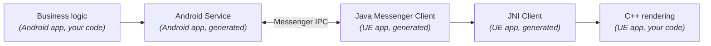

import Figure from '@site/src/components/figure'

You already have an Android app. It owns the data — vehicle telemetry, sensor state, transactional records — and exposes it through a Java or Kotlin service layer. Now product wants a richer surface on top: a 3D instrument cluster, an operator dashboard, a kiosk experience that needs more than the standard Android UI toolkit gives you. The natural answer is to add an Unreal Engine app as a rendering tier — a second process that draws the HMI and reaches back into your existing Java service for the data it visualizes.

That's a cross-process Android problem with a Java service host on one end and a C++ engine consumer on the other. Bind a `Service`, write a `Messenger` handler, define a `Parcelable` for every payload, hand-roll a JNI surface so the engine's C++ can call into the Java client, then keep the method signatures in sync forever. ApiGear's new [Java template](/template-java/docs/intro) ships the Android counterpart to the Unreal Engine template's new [JNI feature](/template-unreal/docs/features/jni), which generates both a JNI client (for consuming an Android service) and a JNI adapter (for exposing one). Define your interface once, generate both sides, and the Messenger plumbing, parcels, and JNI bindings appear together. This post walks through the realistic case — *Android app hosts the service, UE app consumes it* — and shows what comes out of the generator.

<!--truncate-->

## The architecture

The deployment we care about pairs an existing Android codebase with a UE-rendered front end:

- **Your Android app** is the system of record. Its existing repositories, daemons, and domain logic own the data. The Java template generates the Android `Service` that exposes that logic over `Messenger` IPC.
- **Your UE app** is the rendering tier. The Unreal Engine template generates the C++ JNI Client that calls into a generated Java client, which in turn binds to the Android service in the other process. The C++ side never sees `Messenger`; it sees a typed C++ subsystem.

<Figure caption="Service/client architecture: the Android app hosts the data, the Java template generates the Messenger service, the Unreal Engine template generates the JNI client the UE C++ code talks to.">



</Figure>

The Java template generates the `Service`, the `Messenger` handler, the `Parcelable` payloads, and a Java client any other process can drop in (see the [`android` feature reference](/template-java/docs/features/android) for the full output surface). The Unreal Engine template generates the C++ JNI Client that wraps the generated Java client — UE C++ code calls typed methods, JNI dispatches them through the Java client over the Messenger boundary to the host service (see the [`jni` feature reference](/template-unreal/docs/features/jni)). You write the backend (in Java or Kotlin, plugging into your existing data layer) and the C++ rendering code that consumes results. Everything between is generated.

## The IDL

The same `HelloWorld` example used throughout the [ApiGear quick start](/docs/guide/quick-start) is enough to show the shape end-to-end. One property, one signal, one operation — and a custom struct and enum so the cross-language type story shows up:

```yaml title="helloworld.module.yaml" showLineNumbers
schema: apigear.module/1.0
name: io.world
version: "1.0.0"

interfaces:
  - name: Hello
    properties:
      - { name: last, type: Message }
    operations:
      - name: say
        params:
          - { name: msg, type: Message }
          - { name: when, type: When }
        return:
          type: int
    signals:
      - name: justSaid
        params:
          - { name: msg, type: Message }
enums:
  - name: When
    members:
      - { name: Now, value: 0 }
      - { name: Soon, value: 1 }
      - { name: Never, value: 2 }
structs:
  - name: Message
    fields:
      - { name: content, type: string }
```

The IDL is direction-agnostic — the same module describes the API regardless of which side hosts it. The solution document is where the deployment shape shows up. We need three targets, because the Java template generates code for *both* sides of the Messenger boundary; host and consumer pick different classes from the same output:

```yaml title="helloworld.solution.yaml" showLineNumbers
schema: "apigear.solution/1.0"
name: hello_world_example
version: "0.1.0"

targets:
  # The existing Android app: hosts the service.
  - name: android_service
    inputs:
      - helloworld.module.yaml
    output: ../AndroidApp/app/src/main/java
    template: apigear-io/template-java@v0.1.0
    force: true
    features:
      - api
      - android
      - stubs

  # The UE app: needs the Java-side Messenger client under android/.
  - name: ue_java
    inputs:
      - helloworld.module.yaml
    output: ../UEProject/android
    template: apigear-io/template-java@v0.1.0
    force: true
    features:
      - api
      - android
      - jnibridge

  # The UE app: C++ JNI Client under Plugins/.
  - name: ue_cpp
    inputs:
      - helloworld.module.yaml
    output: ../UEProject/Plugins
    template: apigear-io/template-unreal@v4.0.0-beta-149
    force: true
    features:
      - api
      - jni
      - stubs
```

The Android app target picks up [`stubs`](/template-java/docs/features/stubs) so you also get a starting backend implementation; the UE-side Java target enables [`jnibridge`](/template-java/docs/features/jnibridge) so the generated C++ JNI client has a matching Java-side bridge to call into. Run `apigear generate solution helloworld.solution.yaml` and three output trees drop into place from one module file.

## What gets generated

The excerpts below come from a fresh run against the module above. Paths are relative to your output trees so you can find them in your own project.

### On the Android service host (Java template)

The Java API surface is a plain interface — getters, setters, methods, event listeners. From `ioWorld/ioWorld_api/src/main/java/ioWorld/ioWorld_api/IHello.java`:

```java title="IHello.java" showLineNumbers
public interface IHello {
    // properties
    void setLast(Message last);
    Message getLast();
    void fireLastChanged(Message newValue);

    // methods
    int say(Message msg, When when);
    CompletableFuture<Integer> sayAsync(Message msg, When when);
    public void fireJustSaid(Message msg);

    void addEventListener(IHelloEventListener listener);
    // ...
}
```

This is the seam between generated plumbing and your existing code. With `stubs` enabled, the template emits a starter implementation at `ioWorld/ioWorld_impl/src/main/java/ioWorld/ioWorld_impl/HelloService.java` that you replace with calls into your real data layer:

```java title="HelloService.java" showLineNumbers
public class HelloService extends AbstractHello {

    private Message m_last = new Message();

    @Override
    public void setLast(Message last) {
        if (m_last == null || !m_last.equals(last)) {
            m_last = last;                  // <- replace with your repository call
            onLastChanged(m_last);          // notifies bound clients
        }
    }

    @Override
    public Message getLast() {
        return m_last;                       // <- read from your existing data source
    }

    @Override
    public int say(Message msg, When when) {
        // <- delegate to your existing service / domain logic
        return 0;
    }
}
```

No C++ on this side. No JNI. The `onLastChanged` / `fireJustSaid` calls fan out through the generated event listener machinery to whoever is bound — including the UE app's client.

The Messenger service that wraps that backend is generated alongside it. From `ioWorld/ioWorld_android_service/src/main/java/ioWorld/ioWorld_android_service/HelloServiceAdapter.java`:

```java title="HelloServiceAdapter.java" showLineNumbers
public class HelloServiceAdapter extends Service {

    private Messenger mMessenger;
    private static IHello mBackendService;

    @Override
    public IBinder onBind(Intent intent) {
        return mMessenger.getBinder();
    }

    class IncomingHandler extends Handler implements IHelloEventListener {

        @Override
        public void handleMessage(Message msg) {
            HelloMessageType msgType = HelloMessageType.fromInteger(msg.what);
            switch (msgType) {
                case REGISTER_CLIENT: /* track replyTo, send INIT snapshot */ break;
                case PROP_Last:       mBackendService.setLast(/* parcel */); break;
                case RPC_SayReq:      /* invoke backend.say, post RPC_SayResp */ break;
                // ...
            }
        }
    }
}
```

The handler decodes a generated message-type enum, unpacks parcels, dispatches to your backend, and pushes property changes and signals back out to every bound client. The IPC schema is shared between both sides as a single enum — the same `HelloMessageType.java` is consumed by the service and by the UE-side client:

```java title="HelloMessageType.java" showLineNumbers
public enum HelloMessageType {
    REGISTER_CLIENT(0),
    UNREGISTER_CLIENT(1),
    INIT(2),
    PROP_Last(3),
    SET_Last(4),
    SIG_JustSaid(5),
    RPC_SayReq(6),
    RPC_SayResp(7),
    HelloMessageType_UNKNOWN(Integer.MAX_VALUE);
    // ...
}
```

The Android `Service` declarations are pre-wired in the manifest at `ioWorld_android_service/src/main/AndroidManifest.xml`:

```xml title="AndroidManifest.xml" showLineNumbers
<service
    android:name="ioWorld.ioWorld_android_service.HelloServiceAdapter"
    android:enabled="true"
    android:exported="true">
</service>
```

One service per interface, exported, ready to bind. You don't author this file — the template emits it.

### In the Unreal Engine client (Unreal Engine template)

The UE plugin's JNI module wraps the generated Java client (`HelloJniClient`) so your C++ code never touches `Messenger` directly. From `IoWorld/Source/IoWorldJni/Private/Generated/Jni/IoWorldHelloJniClient.cpp`:

```cpp title="IoWorldHelloJniClient.cpp" showLineNumbers
void UIoWorldHelloJniClient::SetLast(const FIoWorldMessage& InLast)
{
    if (GetLast() == InLast) { return; }   // de-dup writes

#if PLATFORM_ANDROID && USE_ANDROID_JNI
    if (JNIEnv* Env = FAndroidApplication::GetJavaEnv()) {
        auto Cache = UIoWorldHelloJniClientCache::Get();
        jmethodID MethodID = Cache->LastSetterId;   // resolved once at startup
        jobject jlocal_Last = IoWorldDataJavaConverter::makeJavaMessage(Env, InLast);
        FJavaWrapper::CallVoidMethod(Env, m_javaJniClientInstance, MethodID, jlocal_Last);
        Env->DeleteLocalRef(jlocal_Last);
    }
#endif
}
```

The same `say` operation shows up as `say(Message, When)` in Java, as `nativeOnSayResult` callbacks coming back over JNI, and as `Say(const FIoWorldMessage&, EIoWorldWhen)` in UE C++ — generated together, kept in sync forever. The `makeJavaMessage` and matching `makeJavaWhen` helpers — the converters that move your custom struct and enum across the JNI boundary — are generated next door in `IoWorldDataJavaConverter.cpp`.

## Wiring it up

Three things you still own, plus one note for Blueprint use:

**The backend implementation.** The generated `HelloService` is a stub in your Android app's source tree. Replace it with your real implementation, wrapping whatever data layer you have today — repository, domain service, daemon. The generated code never touches that layer; it just calls your `IHello` implementation.

**Binding from UE to the host service.** The generated UE C++ subsystem (`UIoWorldHelloJniClient`) exposes a `_bindToService(servicePackage, connectionId)` call that takes the *Android app's* package name; it can be driven from blueprints. See the [JNI feature docs](/template-unreal/docs/features/jni) for the package-name coordination details — the Android manifest entries the UE side needs (service declarations, queries for cross-process binding, and Java source inclusion) are emitted into an Unreal Plugin Language file (`IoWorld_JNI_UPL.xml`) and applied automatically by the build.

**Reconnect logic, if you want any.** The generated client does not auto-reconnect when the host service dies. If your deployment cares — most embedded ones will — handle it on the UE side, around the `_bindToService` call.

**Blueprint use.** The generated client is `BlueprintType`, so cluster artists and HMI designers can consume the cross-process data directly from Blueprints — operations, property accessors, and signal subscriptions all surface through the same Blueprint-exposure pattern ApiGear's OLink and MsgBus clients already use, with no JNI-specific extra wiring on the BP side. Subclassing the client itself is disabled (`NotBlueprintable`); you consume the instance, you don't extend it.

A few constraints worth flagging up front:

- Minimum Android SDK is 33 on both apps.
- Each interface in your module becomes a separate Android service. That's by design (each is independently bindable) but counts against your manifest budget.
- Custom struct and enum types translate automatically; `extern` types still need a hand-written converter (`fillYourExternName`, `makeJavaYourExternName` skeletons are generated for you to fill in).

## When this is the right tool

The pairing earns its keep when the Android side already exists and the UE side is the new surface:

- **Automotive HMI.** Vehicle data — vehicle properties surfaced by CarService and VHAL, plus app-layer telematics, media, and navigation — already lives in Java/Kotlin services on the head unit. The UE app renders the cluster or center stack as a client, binding to those services for live data.
- **IoT gateway.** Device daemons in Java or Kotlin own sensor state and protocol bridges. The UE app renders an operator dashboard as a client, subscribing to signals and reading current values.
- **Kiosk and embedded HMI.** The kiosk's domain logic — payments, inventory, session state — lives in an Android service. The UE app renders the customer-facing surface and binds to read state and invoke operations.

The same template pair *also* supports the inverse direction — UE hosts the service, Java/Kotlin clients consume it. That's the case Epic documents in [Setting up Android Single Instance Service in Unreal Engine](https://dev.epicgames.com/documentation/unreal-engine/setting-up-android-single-instance-service-in-unreal-engine). On the C++ side you instantiate the generated JNI *adapter* instead of the JNI client; the Java template's service classes flip from being consumed by the UE Java client to hosting the UE-side Java service. (`jnibridge` stays on the Java target either way — it's what generates the Java side of the JNI bridge, not a direction flag.) Reach for it when the C++ side genuinely owns long-lived state — typically when the UE app is the only thing on the device and other apps are diagnostic helpers around it.

It's the wrong tool for single-process apps. If your UE code and Java code share a process, you don't need IPC and you don't need this generator pair — use the local implementation directly.

## Try it

- [Java template documentation](/template-java/docs/intro) — start here for the Android side.
  - [`android` feature reference](/template-java/docs/features/android) — what the `Service`, `Messenger`, and `Parcelable` generation actually produces.
  - [`jnibridge` feature reference](/template-java/docs/features/jnibridge) — the Java-side half of the cross-language bridge.
- [Unreal Engine template documentation](/template-unreal/docs/intro) — the JNI feature lives alongside the existing OLink, MsgBus, and Monitor features.
  - [`jni` feature reference](/template-unreal/docs/features/jni) — the C++ JNI Client and Adapter, plus the manifest plumbing.
- [ApiGear quick start](/docs/guide/quick-start) — install the CLI and generate your first module.

Define the interface once. Generate both sides. Stop hand-syncing JNI signatures.
