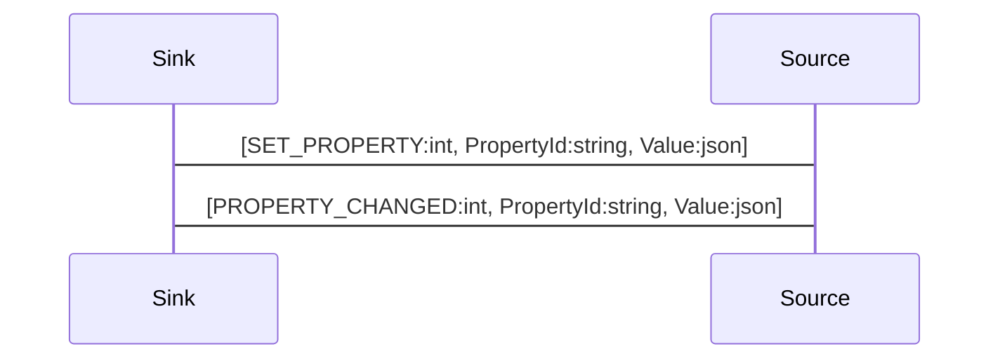

# Property Synchronization

An object can contain a set of properties, which describe the data associated with the object. When a property changes, either locally or remote all linked objecta re notified about the changes and updated.

This allows to distribute data across all linked objects easily and share state between local and remote objects.

## ApiGear Object Model

In ApiGear properties are described as properties inside an interface.

```yaml
name: org.demos

interfaces:
  - name: Echo
    properties:
      - name: message
        type: string
```

The resulting simplified typescript code could look like this.

```js
// org.demos.js
class Echo {
  message: string = ""
}
const echo = new Echo()
echo.message = "foo"
```

## Protocol Flow

First the local object needs to be linked to a remote object.

```js
--> [ LINK, "org.demos.Echo"]
```

Now the local object receive initial property list, which is automatically send after the link message.

```js
<-- [ INIT, 'org.demos.Echo', { message: "hello" } ]
```

After the init message out local object is fully populated and all properties have valid values.


When a property is changed on the local object, for example from "hello" to "foo", a `SET_PROPERTY` message is send.


```js
--> [ SET_PROPERTY, "org.demos.Echo/message", "foo"]
```

The remote object will then set the property and notify all linked objects about the changes using a `PROPERTY_CHANGE` message, including the original sender.

```js
<-- [ PROPERTY_CHANGE, "org.demos.Echo/message", "foo"]
```


## Sequence Diagram

After an object is linked propertie will be synced across all linked clients.

