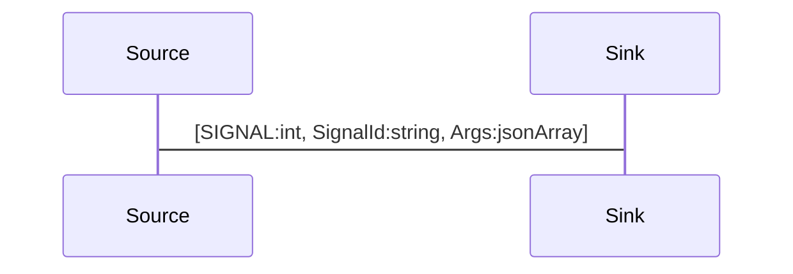

# Server Side Signals

Signals re used to  notify the local object about changes on the remote object.

## ApiGear Object Model

Signals can be modeled using ApiGear as signals of an interface.


```yaml
name: org.demos

interfaces:
  - name: Echo
    signals:
      - name: shutdown
        params:
        - name: timeout
          type: int
```

The resulting code will look somehow like this and most often will require a lambda function to be used for the notification.  
```js
// org.demos.js
class Echo {
  onShutdown(callback)	
}
const echo = new Echo()
echo.onShutdown( (timeout) => {
	console.log('timeout: ', timeout);
})
```

## Protocol Flow

To receive signals the local object needs to be linked to the remote object first.


```js
--> [ LINK, "org.demos.Echo"]
```


Then the remote object can send at any time signals to the linked client objects and notify them on changes.

```js
<-- [ SIGNAL, "org.demos.Echo/shutdown", [10]]
```


To stop receiving signals, just unlink the remote object.


```js
--> [ UNLINK, "org.demos.Echo"]
```


## Sequence Diagram

After an object is linked server side signals will be send.

