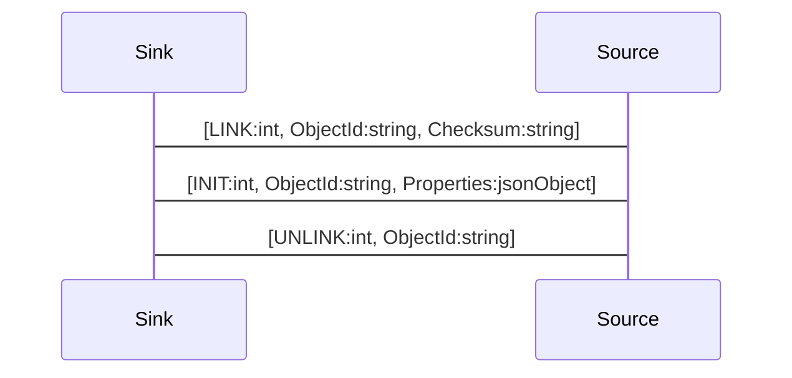

# Lifecycle

To use a remote object the object needs to be linked first using the object name. The `LINK` request will be answered with a `INIT` message to initially populate the local properties from the remote object and subscribe to property changes and signals. After the linking the local object is fully usable.

The check sum is used to verify the remote object is the same as the local object. If the checksum is not the same the link will fail. A checksum should be automatically generated by code generator based on the relevant content of the API module (e.g. interfaces, properties, signals, methods, structs, struct fields, enums, enum values, etc.).

In case the checksum does not match the server will return an error message.

A link message is send by the client to link to a remote object.

```js
--> [ LINK, "org.demos.Echo", CHECKSUM, ]
```

A link message is answered with an init message with the initial properties, or an error message, in case of failure.

```js
<-- [ INIT, 'org.demos.Echo', { message: "hello" } ]
```

To release the resources on the server side the object can also be unlinked, this will also unsubscribe from property changes and signals.

```js
--> [ UNLINK, "org.demos.Echo"]
```

## Sequence Diagram

To link a local object to a remote object we need to send a link message.


