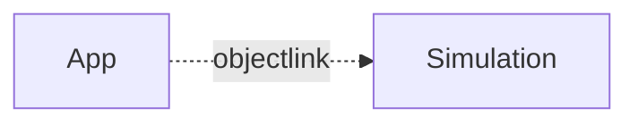

# Service Simulation

## Why?

Simulation of services helps to predict the data and behavior of services. Simulation is used to diagnose problems and to test otherwise difficult to establish behavior. A typical use case is to enable designers to run a user interface without being depending or to wait for a service implementation. This gets even more important when the service runs on embedded or automotive systems where hardware access is often limited.

The simulation shares the same API as a production service and can be used to validate the use of an API without having to implement the actual service. The simulation is interchangeable with a real service and can be used in the same way.

## Simulation file?

A simulation file is a JavaScript file which contains a simulation scenario. The file creates all services required and provides basic implementation of these services. The initial service simulation can be auto generated by the simulation template and then extended by the developer or simply written by hand.

To explain the concept we will use a simple example.

```
module demo

interface Counter {
  count: int
  increment()
  decrement()
}
```

The counter example shows a simple interface which can be used to increment or decrement a reactive counter. The simulation file will look like this:


```javascript
// counter.sim.js

// create a service based on module and interface name and provide initial properties
const counter = $createService("demo.Counter", { count: 0 });

// react to changes of the count property
counter.$on("count", function(value) {
  console.log("count changed to " + value);
});


// provide an implementation for the increment operation
counter.increment = function() {
  // modify the count property, this will trigger the count property change event
  this.count++;
};

// provide an implementation for the decrement operation
counter.decrement = function() {
  this.count--;
};

// provide an autorun function which will be called when the simulation is started
function main() {
  for (let i = 0; i < 10; i++) {
    counter.increment();
    counter.decrement();
  }
}
```

To run the simulation we need to start the server and then run the simulation file. The server will then start the simulation and provide the simulation interface to the client.

The simulkation template will genertae a simulation stub as also typescript type definitions to provide a better developer experience.




## Running the simulation

To run the server we need to start the server.:
```
apigear serve
```

This will run all services (e.g. simulation, monitoring, etc.) and the message bus service.

To run the simulation file we now can use the following command: 

```
apigear sim run counter.sim.js
```

This contact the server and posts the simulation file to the simulation server.

Now you need a client to connect to the simulation server over ObjectLink and trigger the simulation, or you can use the stimulation tool to trigger the simulation.


## Simulation Protocol

The underlying simulation protocol is the way to interact with a simulation server. It defines how to call operations, how to get the state of an interface and how to trigger sequences. The simulation server currently supports the ObjectLink protocol which is available in the [ObjectLink](/docs/advanced/protocols/objectlink/intro) section.

