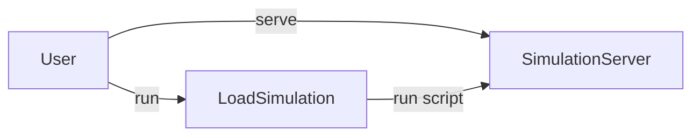

# Simulation Scenarios

A scenario captures the data and behavior of interfaces (aka services). It is used to simulate the behavior of a service. A scenario is a JavaScript file which contains a simulation scenario. The scenario creates all API endpoints using an actor. The initial simulation can be auto generated by the template system and then extended by the developer or simply written by hand.



A scenario is loaded and executed into the simulation server. For this the simulation server has to be started before using (`apigear serve`) or run with the simulation file (`apigear sim run <file> --serve`). In case the simulation server is already running the simulation file can be loaded using the `apigear sim run <file>` command.


## API Definition

Here is a simple API definition and the corresponding simulation scenario:

```js
module demo

interface Counter {
  count: int
  increment()
  decrement()
}
```

The counter example shows a simple interface which can be used to increment or decrement a reactive counter. 

## Simulation file

The simulation file will look like this:

```js
// counter.sim.js

// create a service based on module and interface name and provide initial properties
const counter = $createService("demo.Counter", { count: 0 });

// react to changes of the count property
counter.on("count", function(value) {
  console.log("count changed to " + value);
});

counter.increment = function() {
  this.count++;
};

counter.decrement = function() {
  this.count--;
};

// a main function which will be called when the simulation is started
function main() {
  for (let i = 0; i < 10; i++) {
    counter.increment();
    counter.decrement();
  }
}
```


You run the simulation by starting the server and then run the simulation file. The server will then start the simulation and provide the simulation interface to the client.

```sh
# run a simulation and start the server
$ apigear sim run counter.sim.js
```


