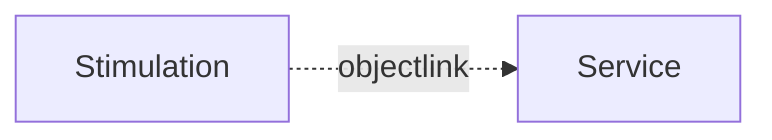

# API Stimulation

## Why?

Stimulation allows to trigger sequences of operations or data changes on a service. This is useful to test the behavior of a service or to simulate a user interaction.



## Stimulation file?

A stimulation file is a JavaScript file which contains a stimulation scenario. The stimulation comes in the form of a client which can be used to trigger sequences of operations or data changes on a service.

Base on this API example we can create a client which can be used to trigger sequences of operations or data changes on a service.

```javascript
module demo

interface Counter {
  count: int
  increment()
  decrement()
}
```


The counter example shows a simple interface which can be used to increment or decrement a reactive counter. The stimulation file will look like this:

```javascript
// counter.stim.js

// create a client based on module and interface name and provide initial properties
const counter = $createClient("demo.Counter", { count: 0 });

// trigger the increment operation
counter.increment();

// trigger the decrement operation
counter.decrement();

function main() {
  for (let i = 0; i < 10; i++) {
    counter.increment();
    counter.decrement();
  }
}
```

To run the stimulation file we need to start the server and and run a service or a simulation file.

## Running the stimulation

To run the server we need to start the server first.
```
apigear serve
```

This will run all services (e.g. simulation, monitoring, etc.) and the message bus service.

We will use a simulation file to simulate a service. 

```
apigear sim run counter.sim.js
```

This will run the simulation and provide the simulation interface to the client.

Now we can run the stimulation file:

```
apigear stim run counter.stim.js
```

This will run the stimulation file and trigger the operations on the simulation interface.
