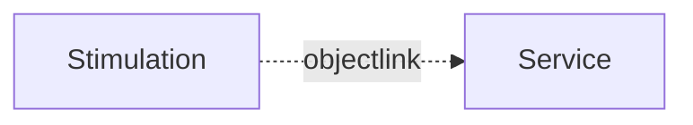

# API Stimulation

:::warning Experimental

The **stimulation** is experimental and may not work yet fully

:::

## Why?

Stimulation allows to trigger sequences of operations or data changes on a service. This is useful to test the behavior of a service or to simulate a user interaction.



## Stimulation file?

A stimulation file is a JavaScript file which contains a stimulation scenario. The stimulation comes in the form of a client which can be used to trigger sequences of operations or data changes on a service.

Base on this API example we can create a client which can be used to trigger sequences of operations or data changes on a service.

```javascript
module demo

interface Counter {
  count: int
  increment()
  decrement()
}
```


The counter example shows a simple interface which can be used to increment or decrement a reactive counter. The stimulation file will look like this:

```javascript
// counter_client.js

const url = "ws://localhost:5555/ws"
const channel = $createChannel(url)

// create a client based on module and interface name
const counter = channel.createClient("demo.Counter");

// Monitor property changes
counter.onProperty("count", function(value) {
  console.log("Count changed to:", value);
});

// Listen for signals if any
counter.onSignal("countReached", function(target) {
  console.log("Count reached:", target);
});

function main() { // main is auto run on script execution
  // Connect to the remote service
  channel.connect();
  
  // Trigger operations
  for (let i = 0; i < 10; i++) {
    counter.callMethod("increment");
    counter.callMethod("decrement");
  }
  
  // Get current property value
  const currentCount = counter.getProperty("count");
  console.log("Final count:", currentCount);
  
  // Optionally disconnect when done
  setTimeout(function() {
    channel.disconnect();
    $quit();
  }, 1000);
}
```

To run the stimulation file we need to start a remote service

## Running the stimulation


We will use a simulation file to simulate a service. 

```
apigear sim run counter_service.js
```

This will run the simulation and provide the simulation interface to the client.

Now we can run the stimulation file:

```
// run simulation client but don't create a server
apigear sim run counter_client.js --no-serve
```

This will run the stimulation file and trigger the operations on the simulation interface.
