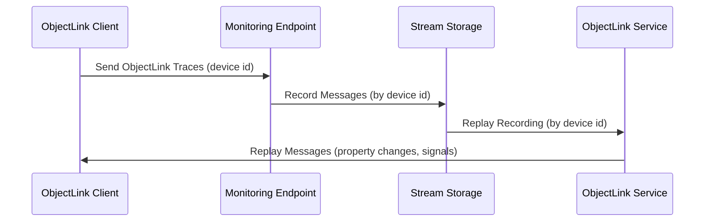

# Streams Introduction

ApiGear streams enable users to record and replay message streams, particularly ObjectLink messages sent via API monitoring. This functionality is essential for debugging, testing, and analyzing message flows in distributed systems.

The ObjectLink protocol is a message-based protocol that uses WebSockets for communication. ApiGear streams capture these messages and store them in a structured format for later retrieval or playback.

Once a message stream is stored, you can export it to share with others or replay it using an ObjectLink client connected to a generic ObjectLink service that replays the messages.

## Key Features

- **Recording**: Capture ObjectLink messages in real-time as they are received through monitoring tools
- **Storage**: Store recorded streams in a structured format for easy access and management
- **Playback**: Replay recorded streams to simulate message flows for testing and debugging purposes
- **Export/Import**: Export recorded streams for sharing with team members or import streams from external sources
