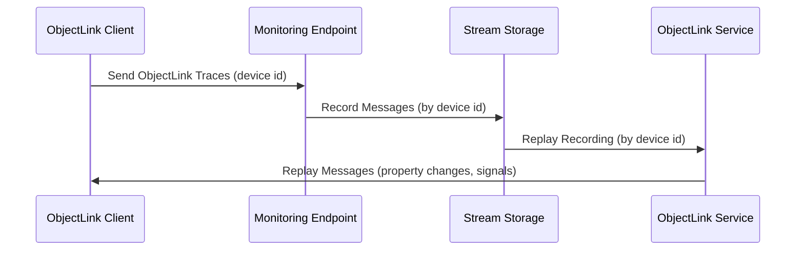

# Streams Introductions

ApiGear streams allow users to record and replay messages streams, especially ObjectLink messages send via API monitoring. This is useful for debugging, testing, and analysis of message flows in distributed systems.

The ObjectLink protocol is a message based protocol which uses websockets for communication. ApiGear streams capture these messages and store them in a structured format for later retrieval or playback.

Once a stream of messages is stored you can export them and share them with others or you can replay them using a ObjectLink client connected a generic ObjectLinnk service which replays the messages.

## Key Features

- **Recording**: Capture ObjectLink messages in real-time as they are received using monitoring tools.
- **Storage**: Store recorded streams in a structured format for easy access and management.
- **Playback**: Replay recorded streams to simulate message flows for testing and debugging.
- **Export/Import**: Export recorded streams for sharing or import streams from other sources.
