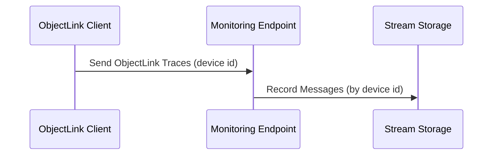
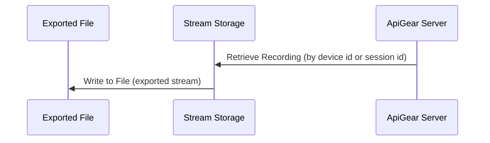
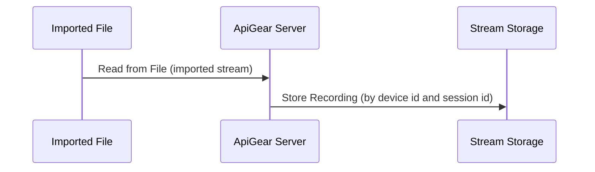

# Record

To record ObjectLink message streams, ApiGear provides tools that capture and store these messages in real-time. This functionality is particularly useful for debugging and analyzing the behavior of distributed systems.

## Automatic Recording

Recording happens automatically when API traces are sent to a monitoring endpoint. The monitoring endpoint captures the ObjectLink messages and stores them in a structured format organized by device ID.

:::note Configuration

Ensure that your API monitoring is configured to send ObjectLink messages to the correct monitoring endpoint.

```
http://localhost:5555/monitor/123/
```

In this example, `123` is the device ID for which messages are recorded. Each device ID should have its own recording session. Verify your API tracing settings to ensure ObjectLink messages are being sent to the correct monitoring endpoint.

:::

## Getting Started

To start recording, you need to start ApiGear in server mode using the `apigear serve` command. The monitoring endpoint will be available at `http://localhost:5555/monitor/{device_id}/` by default.

Once the server is running, you can start sending ObjectLink messages to the monitoring endpoint using your ObjectLink client or API monitoring tool.



:::note Storage and Retention

Recorded streams are stored with a retention period, after which they may be automatically deleted. Export or replay important recordings before they expire.

To view all recorded streams, use:

```bash
apigear streams ls
```

ApiGear uses an embedded NATS server internally to handle the recording and storage of ObjectLink messages.

:::


## Export Recordings

You can export recorded streams for sharing with team members or for backup purposes.

### Export by Device ID

```bash
apigear streams export --device <device_id> --output <file_path>
```

This command creates a file at the specified output path containing the recorded stream data. When using a device ID, the latest session for that device will be exported.

### Export by Session ID

To export a specific session, use the session ID instead:

```bash
apigear streams export --session <session_id> --output <file_path>
```



## Import Recordings

You can import previously exported streams to replay them later. Use the following command to import a stream from a file:

```bash
apigear streams import --input <file_path>
```

This command reads the stream data from the specified file and stores it for later replay using the original device ID and session ID.



:::note File Format

Exported streams use an envelope format that includes metadata about the recording, such as device ID, session ID, and timestamps.

:::