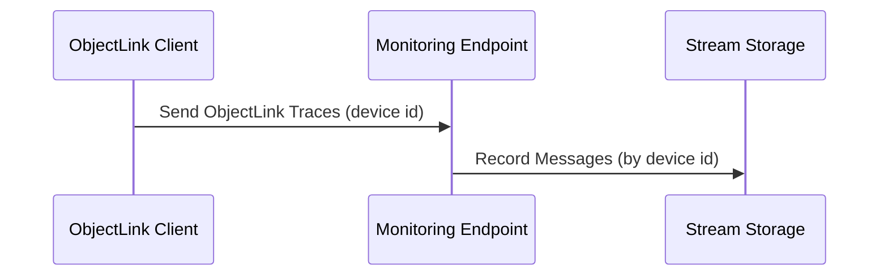
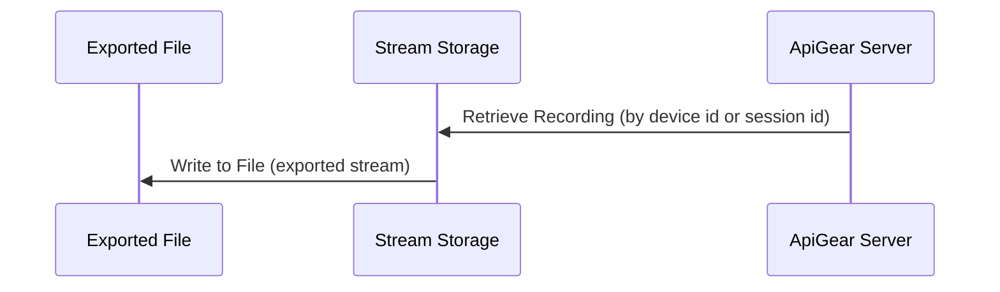
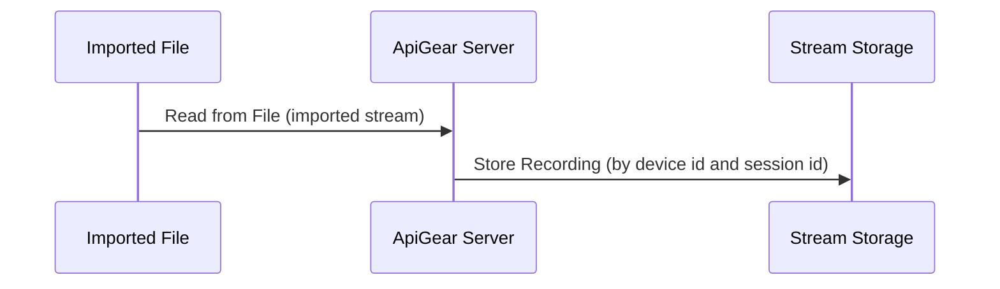

# Record

To record ObjectLink message streams, ApiGear provides tools that capture and store these messages in real-time. This is particularly useful for debugging and analyzing the behavior of distributed systems.

Temporal recording happens automatically when a API traces are send to a monitoring endpoint. The monitoring endpoint captures the ObjectLink messages and stores them in a structured format by device id.

:::note

   Ensure that your API monitoring is configured to send ObjectLink messages to the correct monitoring endpoint.

   ```
   http://localhost:5555/monitor/123/
   ```

   123 is the device id for which the messages are recorded. Each device id should have its own recording. Please check your API tracing settings to ensure that ObjectLink messages are being sent to the correct monitoring endpoint.

:::


To start a recording you neeed to start apigear in the server mode using `apigear serve` command. The monitoring endpoint will be available at `http://localhost:5555/monitor/{device_id}/` by default.

Then you can start sending ObjectLink messages to the monitoring endpoint using your ObjectLink client or API monitoring tool.



:::note

    Recorded streams are stored and have a retention period after which they may be deleted. Ensure to export or replay important recordings before they expire.

    To see the list of recorded streams you can list the recordings using apigear streams command:

    ```bash
    apigear streams ls
    ```

    Internally we are using an embedded NATS server to handle the recording and storage of ObjectLink messages.

:::


## Export

You can export recorded streams to share them with others or for backup purposes. Use the following command to export a recorded stream by device id:

```bash
apigear streams export --device <device_id> --output <file_path>
```

This will create a file at the specified output path containing the recorded stream data. When using the device id, the latest session for that device id will be exported. To export a specific session, you can use the session id instead of the device id.



## Import 

You can import previously exported streams to replay them later. Use the following command to import a stream from a file:

```bash
apigear streams import --input <file_path>
```

This will read the stream data from the specified file and store it for later replay under the original device id and session id.



:::note

    Exported streams are stored using an envelope format which includes metadata about the recording such as device id, session id, and timestamps.

:::