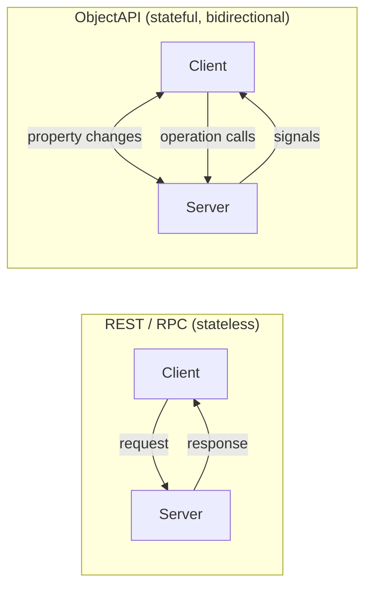

# Introduction

ObjectAPI is a specification for defining **stateful, object-oriented APIs**. Unlike REST or RPC specifications that model stateless request/response interactions, ObjectAPI models interfaces as objects with observable state.

## A Shared Language, From Prototype to Production

ObjectAPI deliberately models the **familiar object pattern** — **properties**, **operations** (methods), and **signals** (events) — so a single definition reads naturally to everyone who touches it. That makes it a **common ground** where designers and backend engineers align on one contract, instead of trading documents and assumptions.

And because the same definition drives simulation, generated stubs, and production SDKs, a single ObjectAPI artifact carries a feature **from rapid prototype to production** — no throwaway spec, no rewrite when you cross into real code.

## Why Stateful APIs?

Most API specifications — OpenAPI, and gRPC/protobuf in their common request/response form — are built around stateless request/response. But many real-world systems have inherent state:

| Domain | Examples of State |
|--------|-------------------|
| **Automotive** | Vehicle speed, door lock status, climate settings |
| **Game Engines** | Player position, inventory, game state |
| **IoT/Embedded** | Sensor readings, device configuration |
| **UI Applications** | Form data, selection state, view models |

ObjectAPI models APIs the way programmers naturally think about objects — with **properties** (state), **operations** (methods), and **signals** (events).



## The Three Pillars

| Concept | What it is | Analogy |
|---------|------------|---------|
| **Properties** | Observable state that can change over time | Class member variables with change notifications |
| **Operations** | Methods you can call (sync or async) | Class methods |
| **Signals** | Server-initiated events pushed to clients | Qt signals, C# events, callbacks |

## Two Formats, One Specification

ObjectAPI supports two equivalent formats:

### IDL Format (recommended for authoring)

A concise, developer-friendly syntax that looks like a programming language:

```go
module org.example 1.0

interface Thermostat {
    // Properties (state)
    temperature: float      // current temperature
    targetTemp: float       // desired temperature
    isHeating: bool         // heating active?

    // Operations (methods)
    setTarget(float temp)
    reset()

    // Signals (events)
    signal overheated(float temp)
}
```

### YAML Format (canonical)

The same API in YAML — used internally and for programmatic generation:

```yaml
schema: apigear.module/1.0
name: org.example
version: "1.0"

interfaces:
  - name: Thermostat
    properties:
      - { name: temperature, type: float }
      - { name: targetTemp, type: float }
      - { name: isHeating, type: bool }
    operations:
      - name: setTarget
        params:
          - { name: temp, type: float }
      - name: reset
    signals:
      - name: overheated
        params:
          - { name: temp, type: float }
```

The IDL format is automatically transformed to YAML by ApiGear tools. Both formats are fully equivalent.

## When to Use ObjectAPI

**Use ObjectAPI when:**
- Your system has observable state that changes over time
- Clients need to be notified of state changes (not just poll)
- You're building interfaces for C++, Qt, Unreal, or embedded systems
- You want APIs that map naturally to object-oriented code

**Consider alternatives when:**
- You're building stateless REST APIs (use OpenAPI)
- You need high-performance binary serialization only (use protobuf)
- You're documenting HTTP endpoints (use OpenAPI)

## Specification Details

#### Version 0.2.0

The key words "MUST", "MUST NOT", "REQUIRED", "SHALL", "SHALL NOT", "SHOULD", "SHOULD NOT", "RECOMMENDED", "MAY", and "OPTIONAL" in this document are to be interpreted as described in [RFC 2119](http://www.ietf.org/rfc/rfc2119.txt).

## Definitions

| Term | Definition |
|------|------------|
| **System** | A collection of modules describing a coherent set of APIs |
| **Module** | A namespaced collection of interfaces, structures, and enumerations (one per file) |
| **Interface** | A named object with properties, operations, and signals |
| **Property** | Observable state on an interface that can change and notify observers |
| **Operation** | A method that can be called on an interface |
| **Signal** | An event emitted by the server to notify clients |
| **Structure** | A data type with fields (no operations or signals) |
| **Enumeration** | A set of named integer values |
