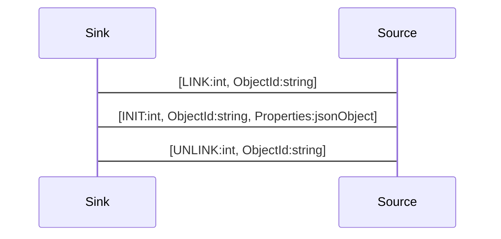

# Lifecycle

To use a remote object the object needs to be linked first using the object name. The `LINK` request will be answered with a `INIT` message  to initially populate the local properties from the remote object and subscribe to property changes and signals. After the linking the local object is fully usable.

A link message is send by the client to link to a remote object.

```js
--> [ LINK, "org.demos.Echo"]
```

A link message is answered with an init message with the initial properties, or an error message, in case of failure.
```js
<-- [ INIT, 'org.demos.Echo', { message: "hello" } ]
```

To release the resources on the server side the object can also be unlinked, this will also unsubscribe from property changes and signals.

```js
--> [ UNLINK, "org.demos.Echo"]
```

## Sequence Diagram

To link a local object to a remote object we need to send a link message. 

