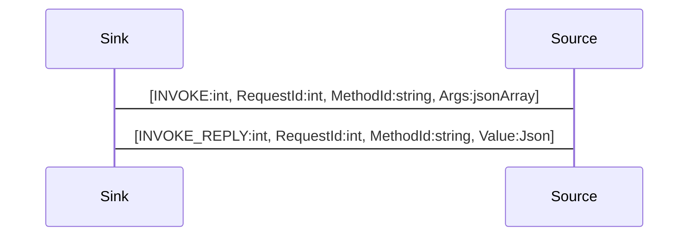

# Method Invokation

A remote invokation invokes asynchronously a method on a remote object and returns the result.

## ApiGear Object Model

To model methods in ApiGear you define an interface with operations.


```yaml
name: org.demos

interfaces:
  - name: Echo
    operations:
      - name: say
        params:
        - name: msg
          type: string
        type: string
```

The operations will be generated as methods of the object. This will look simplified like this.


```js
// org.demos.js
class Echo {
  async say(msg: string): string
}

const echo = new Echo()
console.log(echo.say("hello"))
$> hello
````

## Protocol Flow

To invoke remote method an method name and the method arguments must be specified. The reply can only have on value, which can have any complexity.

The local object sends an `INVOKE` message to the remote object using a request id, the method name and method arguments.

```js
--> [ INVOKE, 1, "org.demos.Echo/say", ["echo"]]
```

The remote object executes the method and returns the reply or an error message in case of failure. 

```js
<-- [ INVOKE_REPLY, 1, "echo"]
```


## Sequence Diagram

After an object is linked remote methods can be called.

