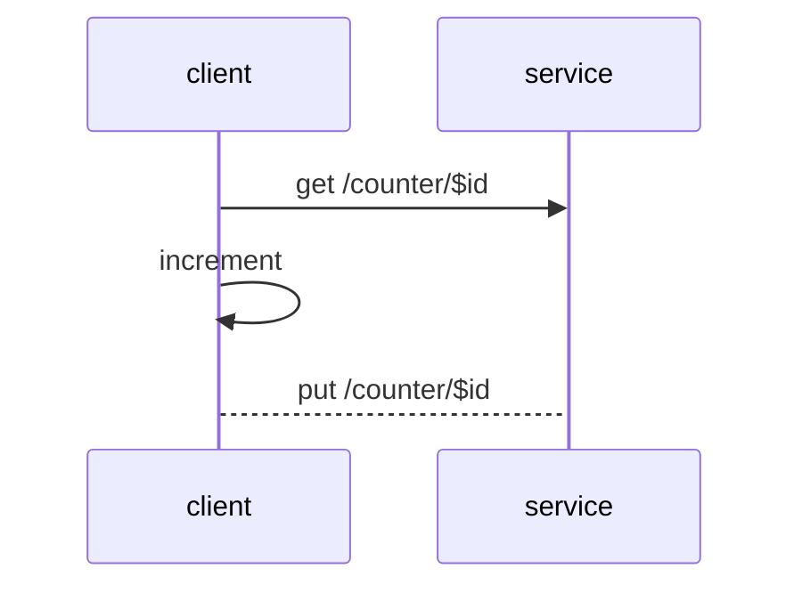
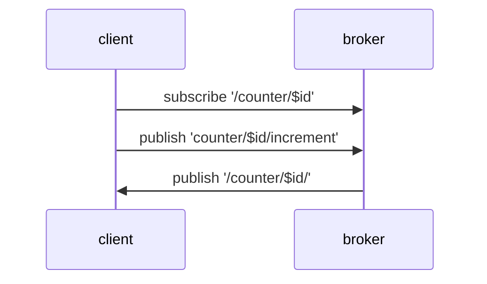
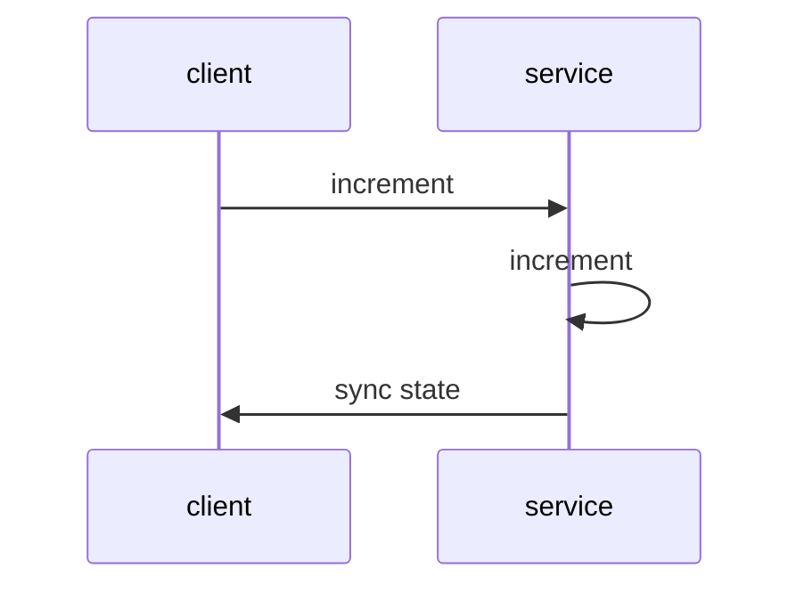

# Protocol Mappings

ObjectAPI describes object communication patterns based on simple to use protocols. These communication patterns can be mapped to other communication patterns.


## API Types

There exists currently several API types, like REST, Message Based or RPC. ObjectAPI supports a mixture of these.

| API style | Communication | State model | Real-time updates | Strengths | Trade-offs |
|---|---|---|---|---|---|
| **REST** | request/response over HTTP | stateless; client drives logic | none (poll) | ubiquitous tooling, cacheable, simple | chatty for live state; logic leaks to the client |
| **RPC** | request/response (function calls) | stateless calls | none | natural call semantics, efficient | tighter coupling; no built-in events |
| **Message based** | publish/subscribe via broker | event / stream | yes (push) | decoupled, many-to-many, real-time | needs a broker; eventual consistency |
| **ObjectAPI** | properties, methods & signals | **stateful objects** | yes (auto-synced) | models real state, clean developer API, maps onto all of the above | needs a code generator (ApiGear) |

### REST based APIs

REST API is about browsing data but the underlying nature of the protocol is HTTP. HTTP is a request/response protocol and as such is architecture wise next to RPC. REST itself defines an architectural style on top of HTTP.

For example to increment a value this logic would be in REST like this.



We first fetch the counter state, than increment the count value and push back the result. The logic is on the client side and the service mostly manages data.

A typical API would look like this:

```js
const client = new HttpClient();
const data = await client.get("/counter/$id");
data.count += 1;
await client.put("/counter/$id");
```

Often these kind of APIs makes it hard in complex logic driven services to validate operations and data.

### Message based APIs

Message based APIs are typically realized using a message broker. The broker is responsible to ensure all messages are delivered to the subscribed or registered peers.



First we subscribe to an interface's state changes. Then we publish an increment message and wait for changes on the interface state. The changes are announced by the service via the broker.

A typical message based client would look like this:

```js
const client = new MessageClient();
client.subscribe("/counter/$id");
client.on("/counter/$id", (v) => {
  console.log(v);
});
client.publish("/counter/$id/increment");
```

### Object based APIs

Object based APIs focus on the developer API and take care of the internal mapping to the different protocol types. Interface properties will be typically automatically synced and signals will allow service side notifications to the clients.



The API for this would look like this.

```js
const client = new CounterClient();
client.on((s) => {
  console.log(s.count);
});
await client.increment();
```

First we register a callback when the interface state changes. Then we call the operation, as we defined an object API the API feels and works as developers would expect this.

This makes it much nicer and easier to use the API inside your application. The API pattern also extends to the service side, where service calls land in an API that looks very much like the defined ObjectAPI.

## Is ApiGear an alternative to REST, gRPC, AsyncAPI, or DDS?

Short answer: **no — and that's the point.** ApiGear works at a different layer. You
describe your interface once with ObjectAPI (the *spec*), and ApiGear *generates* the
client and service code that runs **over** a transport like OLink, MQTT, NATS, or HTTP.
REST, gRPC and MQTT are things ApiGear targets, not things it replaces.

It helps to separate the layers:

| Layer | What it is | Examples |
|---|---|---|
| **Spec / IDL** | describes the interface | **ObjectAPI**, OpenAPI, AsyncAPI, Protobuf |
| **Paradigm** | the interaction model | stateful objects (ObjectAPI) · request/response (REST, RPC) · pub/sub (messaging) |
| **Transport** | moves the bytes | OLink, MQTT, NATS, HTTP, HTTP/2 — plus service/data middlewares like SOME/IP and DDS |
| **Codegen** | turns the spec into SDKs | **ApiGear**, OpenAPI Generator, protoc |

ApiGear spans the spec, paradigm and codegen layers while staying transport-agnostic, so
the same definition can run over different transports — chosen per feature.

**vs OpenAPI** — Both are specs you generate code from. OpenAPI describes *request/response HTTP
APIs* (the resource-oriented, typically stateless REST style); ObjectAPI describes *stateful
objects* — observable properties, operations, and
server-pushed signals — with a single source of truth. If your service is mostly CRUD over
HTTP, OpenAPI is a fine fit. If it has live state that clients must stay in sync with,
ObjectAPI models that directly.

**vs AsyncAPI** — AsyncAPI is the event-driven counterpart to OpenAPI: a spec for *messages
and channels* over messaging technologies like MQTT, Kafka or NATS. It describes the *messaging* — you still
design topics and payloads. ObjectAPI describes the *object* — properties, operations,
signals — and generates the messaging for you (properties auto-sync, signals become events).
Reach for AsyncAPI when the message stream itself is the contract; reach for ObjectAPI when
stateful objects are, and you'd rather not hand-design every topic.

**vs gRPC** — gRPC is an RPC *framework*: Protobuf (its IDL) + HTTP/2 (its transport) +
streaming + codegen, bundled together. ApiGear sits one layer up — you define the object
model once and generate code over whichever transport you choose. gRPC isn't a built-in
transport today, but the templates are extensible: a gRPC binding *can* be added — generating
gRPC services *from* your ObjectAPI through the same template extension point the built-in
OLink, MQTT and NATS bindings use. The honest framing is "generate gRPC **with** ApiGear," not
"ApiGear **or** gRPC."

**vs MQTT / NATS** — These are *transports*, not API definitions. ApiGear already generates
code that speaks them. You keep your broker; ApiGear gives you a typed object API on top
instead of hand-written topic strings and payload parsing.

**vs SOME/IP & DDS (automotive & embedded middleware)** — These are service and data
middlewares — transports with a built-in service model, not API generators. The fit is
unusually close: a SOME/IP **field** (getter + setter + notifier) is essentially an ObjectAPI
**property**, and its methods and events map to operations and signals; DDS's data-centric
publish/subscribe maps to property sync. Neither is a built-in transport today, but the object
model lines up cleanly — so the same template extension point used for the built-in transports
could generate SOME/IP or DDS bindings *from* one ObjectAPI definition, as it could for gRPC.
You keep your middleware; ApiGear gives you one typed object model shared across every ECU and language.

### When ApiGear is the wrong tool

- A simple, public, cacheable CRUD API → plain REST/OpenAPI is lighter.
- A one-off script with no shared state → you don't need generated stubs.
- Your team is standardized on one middleware's own IDL and tooling (e.g. gRPC or DDS) and
  doesn't need multi-language generation → use it directly (or add a template if you want
  ObjectAPI's object model on top).

## Choosing a transport

ObjectAPI generates the same interface for several transports (also called IPC implementations). Pick the one
that fits your topology — each links to its full wire mapping:

| Transport | Pattern | Needs | Real-time push | Late-join state | Best for | ApiGear Simulation |
|---|---|---|---|---|---|---|
| **[OLink](/docs/protocols/objectlink/intro)** | point-to-point live link (WebSocket) | a server URL | yes (live) | live link only | tight client↔service and simulation links | ✅ |
| **[MQTT](/docs/protocols/mqtt/intro)** | publish/subscribe via broker | an MQTT broker | yes | retained messages | IoT, telemetry, many-to-many | — |
| **[NATS](/docs/protocols/nats/intro)** | publish/subscribe and request/reply | a NATS server | yes | `init` / `state` resync | high-throughput cloud and edge messaging | — |
| **[HTTP](/docs/protocols/http/mapping_http)** | request/response | a web server | no (request-driven) | n/a | simple, REST-style integration | — |

:::note
The [Unreal Engine template](/template-unreal/docs/features/msgbus) also ships a **Message Bus** transport
(zero-configuration UDP for Unreal-to-Unreal IPC), which is specific to Unreal and not part of the
cross-language set above.
:::
