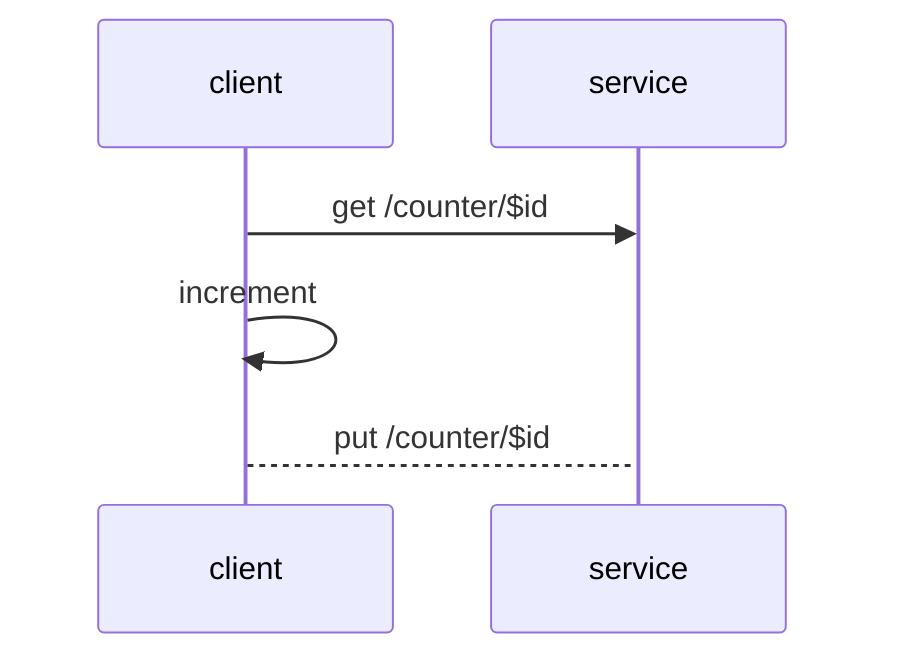
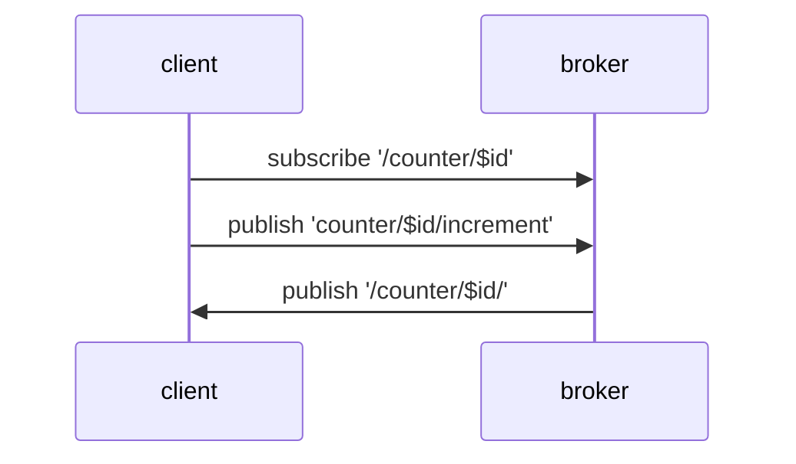
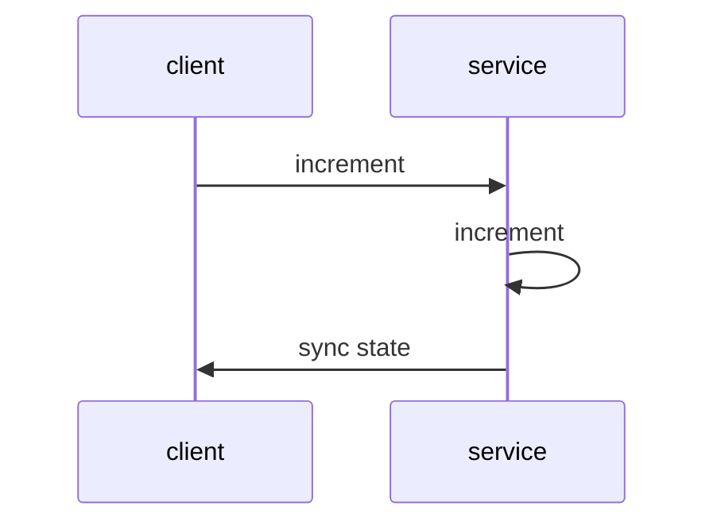

# Protocol Mappings

ObjectAPI describes object communication patterns based on simple to use protocols. These communication patterns can be mapped to other communication patterns.


## API Types

There exists currently several API types, like REST, Message Based or RPC. ObjectAPI supports a mixture of these.

| API style | Communication | State model | Real-time updates | Strengths | Trade-offs |
|---|---|---|---|---|---|
| **REST** | request/response over HTTP | stateless; client drives logic | none (poll) | ubiquitous tooling, cacheable, simple | chatty for live state; logic leaks to the client |
| **RPC** | request/response (function calls) | stateless calls | none | natural call semantics, efficient | tighter coupling; no built-in events |
| **Message based** | publish/subscribe via broker | event / stream | yes (push) | decoupled, many-to-many, real-time | needs a broker; eventual consistency |
| **ObjectAPI** | properties, methods & signals | **stateful objects** | yes (auto-synced) | models real state, clean developer API, maps onto all of the above | needs a code generator (ApiGear) |

### REST based APIs

REST API is about browsing data but the underlying nature of the protocol is HTTP. HTTP is a request/response protocol and as such is architecture wise next to RPC. REST itself defines an architectural style on top of HTTP.

For example to increment a value this logic would be in REST like this.



We first fetch the counter state, than increment the count value and push back the result. The logic is on the client side and the service mostly manages data.

A typical API would look like this:

```js
const client = new HttpClient();
const data = await client.get("/counter/$id");
data.count += 1;
await client.put("/counter/$id");
```

Often these kind of APIs makes it hard in complex logic driven services to validate operations and data.

### Message based APIs

Message based APIs are typically realized using a message broker. The broker is responsible to ensure all messages are delivered to the subscribed or registered peers.



First we would subscribe to and interface state changes. Then we would publish the increment signal and wait for changes on the interface state. The changes are announces by the service via the broker.

A typical message based client would look like this:

```js
const client = new MessageClient();
client.subscribe("/counter/$id");
client.on("/counter/$id", (v) => {
  console.log(v);
});
client.publish("/counter/$id/increment");
```

### Object based APIs

Object based APIs focus on the developer API and take care of the internal mapping to the different protocol types. Interface properties will be typically automatically synced and signals will allow service side notifications to the clients.



The API for this would look like this.

```js
const client = new CounterClient();
client.on((s) => {
  console.log(s.count);
});
await client.increment();
```

First we register a callback when the interface state changes. Then we call the operation, as we defined an object API the API feels and works as developers would expect this.

This makes it much nicer and easier to use the API inside your application. The
The API patterns is also extended to the service side, where service calls end into an API which looks very mich like the defined ObjectAPI.

## Choosing a transport

ObjectAPI generates the same interface for several transports (also called IPC implementations). Pick the one
that fits your topology — each links to its full wire mapping:

| Transport | Pattern | Needs | Real-time push | Late-join state | Best for | ApiGear Simulation |
|---|---|---|---|---|---|---|
| **[OLink](/docs/protocols/objectlink/intro)** | point-to-point live link (WebSocket) | a server URL | yes (live) | live link only | tight client↔service and simulation links | ✅ |
| **[MQTT](/docs/protocols/mqtt/intro)** | publish/subscribe via broker | an MQTT broker | yes | retained messages | IoT, telemetry, many-to-many | — |
| **[NATS](/docs/protocols/nats/intro)** | publish/subscribe and request/reply | a NATS server | yes | `init` / `state` resync | high-throughput cloud and edge messaging | — |
| **[HTTP](/docs/protocols/http/mapping_http)** | request/response | a web server | no (request-driven) | n/a | simple, REST-style integration | — |

:::note
The [Unreal Engine template](/template-unreal/docs/features/msgbus) also ships a **Message Bus** transport
(zero-configuration UDP for Unreal-to-Unreal IPC), which is specific to Unreal and not part of the
cross-language set above.
:::
