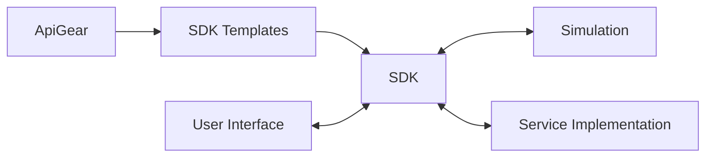
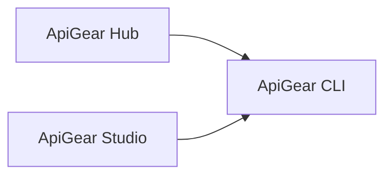
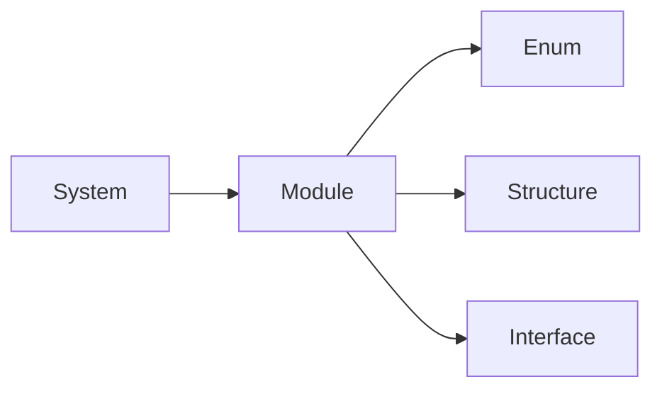
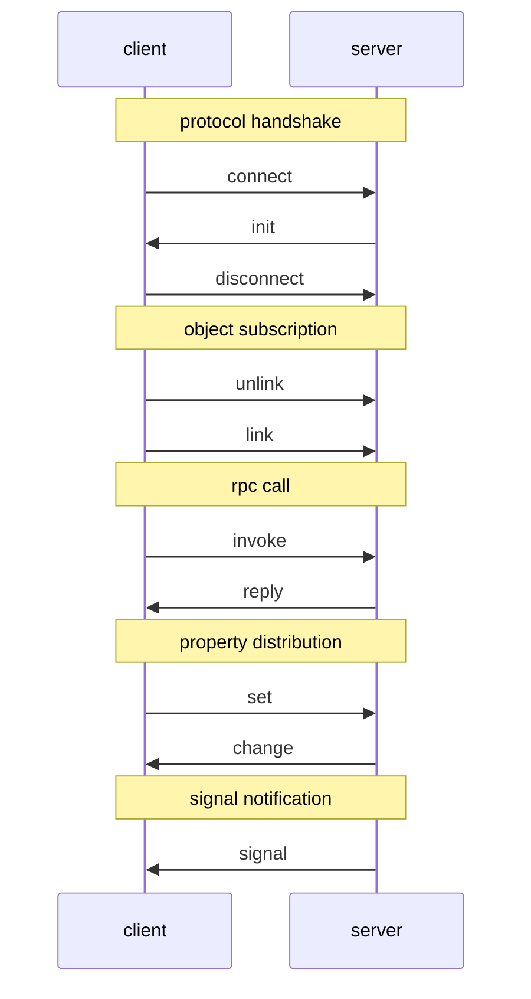
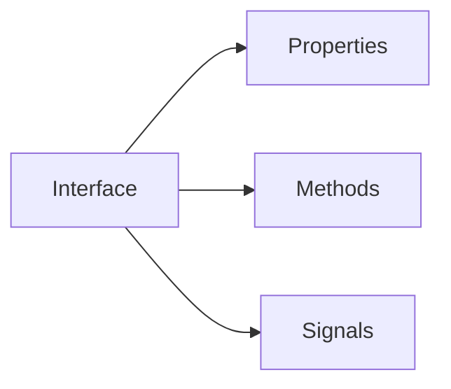
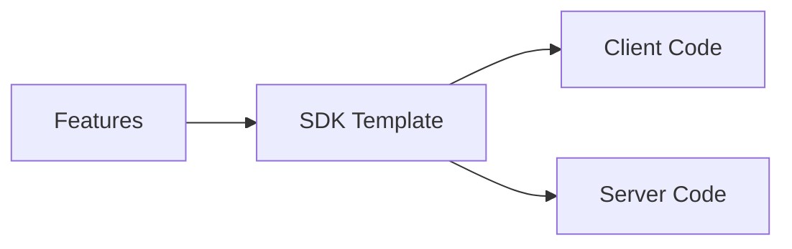
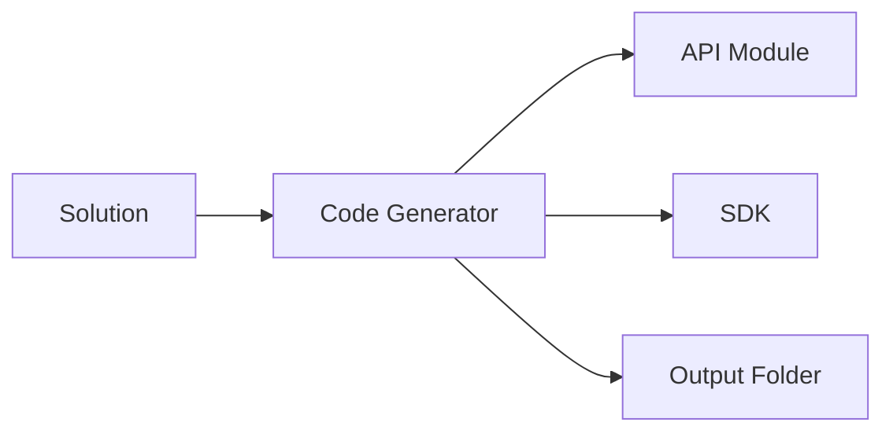

# What is ...?

## ApiGear

ApiGear is a collection of tools and templates to make it easier to bridge user interfaces towards service implementations. It started out of the needs to easily adapt an user interface towards an ever changing service API done by another team. As a user interface developer, it is very difficult to adapt to these changes when you are focused on the user experience. It disrupts your day, when a service API is changing and your user interface fails at random places, due to the changes. Also for service developers, they normally focus on the business logic and less on how user interface needs.

The goal is to make it easier to adapt and decouple the user interface from the service API. Ideally this results always into a clean architecture independent of the skills of the developers.

We experienced that is hard to keep an evolving, half finished user interface in sync with an evolving, half finished service API. Both are changing constantly and are often managed by different teams. ApiGear is a tool to help to manage this complexity by introducing a contract and clear separation between the user interface and the service API.

An even more problematic issue arises, when working with services which run on a dedicated custom HW. Often these services are difficult to port or to connect to a PC development environment. This makes it difficult and slow to develop and test the user interface. ApiGear introduces a simulation layer which allows to simulate the service API. This allows to develop and test the user interface without the need of the HW.

## Tooling

ApiGear comes with several tools for different environments and user needs. The studio is a PC desktop tool for more visual users. The CLI is a command line tool for terminal users. The Hub is a web based tool to share and discover across teams SDK templates and API modules and runtime data.

### ApiGear CLI

ApiGear CLI (Command Line Interface) is a command line tool to generate code from API modules. It allows to manage SDK templates, API project creation, code generation, API monitoring and API simulation tasks. By this it is ideal to run it in the terminal or in a CI/CD pipeline.

Typical tasks are:

- discovery of SDK templates

### ApiGear Studio

ApiGear Studio is a graphical desktop application. It is a visual wrapper around the command line tool and offers very similar functionality but with focus on usability. It is ideal for users who prefer a graphical user interface.

### ApiGear Hub

ApiGear Hub will be the central place to share and discover SDK templates and API modules as also runtime data. It is currently under development.

## API Formats

### Object IDL

Object IDL is a language to describe APIs. It is a simple language to describe objects, properties, methods and signals. It allows to describe the API in a way that it can be used to generate code for different programming languages. It is the core of ApiGear.

Object IDL is modeled after object oriented programming languages like C++, Java, C# and TypeScript. It is a subset of these languages and is designed to be simple and easy to understand. It is not a programming language, but a language to describe APIs.

Object IDL comes with properties, methods and signals. It allows to define objects as interfaces. Properties inside objects are meant for data distribution. A change of a property triggers an change event and is meant to be used for data binding. Methods are used to trigger actions, which then may change properties or trigger signals. Signals are used to notify about changes.

Signals are events which are triggered by service objects. They notify about changes in the service. If a signal is missed it is lost, this is different to properties which kept always up to date on all clients.

### Object Link

Object Link is a protocol to communicate between objects, described by Object IDL. It uses Websockets as transport and JSON as default message format. The Object IDL is used to generate the client and server code. The Object Link protocol is used to communicate between the client and server. Object Link exists for different programming languages.

### Interfaces

The core concept of ApiGear code generation is the interface. An interface is a contract between the client and the server. It defines the properties, methods and signals which are available on the server. The client can modify property data, call methods and listen to signals. The service implements the interface and provides the methods and signals.

An implementation of the interface is called a service. ApiGear does not differentiate between a local (aka in-process) or a remote service (aka out-of-process) service. The only difference is the transport layer, which by default is ObjectLink over websockets. But any other transport layer can be used, by writing an adapter for it.

## SDK Template

An SDK template is a collection of files and folders which are used to generate client and server code from an interface description (IDL). The template is used by the apigear tools to read API modules and generate code, often using solution files.

For larger projects it makes sense to adapt the sdk templates to the project needs. This can be done by creating a custom sdk template. The custom sdk template can be shared with the team and can be used in the project. The custom sdk template can be used to generate the client and server code.

## Solutions

A solution a code generation configuration. It defines which API modules shall be used as input, and which sdk shall be used and which features form the sdk as also the output folder. A solution can be used to generate complex multi language projects from a single apigear call.
